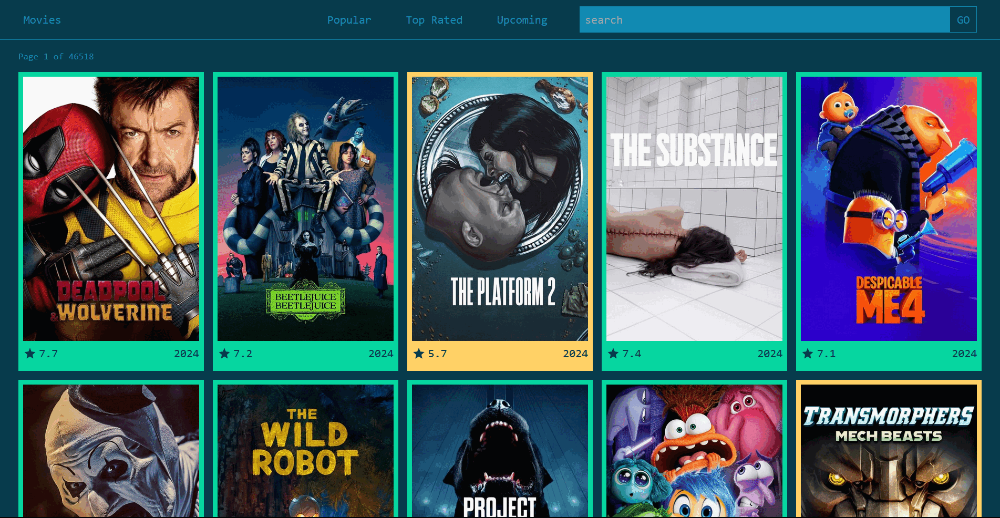

# Movie App

A React-based web application that allows users to browse and search for movies using the TMDB API. The app features multiple sections like popular movies, top-rated movies, upcoming releases, and more, with a clean, responsive design using Tailwind CSS. Movies are visually sorted by their ratings, and various UX improvements such as pagination control and loaders are implemented for better user experience.

## Features

- **Home Page/Popular Movie Page**: Displays the most popular movies.
- **Top Rated Page**: Shows movies with the highest ratings.
- **Upcoming Movie Page**: Lists movies that are yet to be released.
- **Single Movie Detail Page**: Detailed view of a specific movie, including description, release date, and ratings.
- **Searched Movie Page**: Allows users to search for movies using the search bar in the navbar.
- **Responsive Design**: Fully responsive layout powered by Tailwind CSS.

## Additional Features

- **Movie Rating Color-Coding**: 
  - Ratings 0-3: Red
  - Ratings 4-7: Yellow
  - Ratings 7-10: Green
  - Unrated movies: Grey
- **Pagination Control**: The previous button is hidden if there is no previous page.
- **Network Issue Handling**: A loader is displayed when there are network issues.
- **Pulse Animation**: All images feature a pulse animation for a smoother loading effect.

## Demo

Check out a live demo of the app [here](https://shaileshsolanke-movie-app.netlify.app/) (Replace with your live link if hosted).

## Preview

## Tech Stack

- **React**: Frontend framework for building UI components.
- **TMDB API**: For fetching movie data (https://www.themoviedb.org/documentation/api).
- **Tailwind CSS**: Utility-first CSS framework for styling.
- **Vite**: For fast development and bundling.

